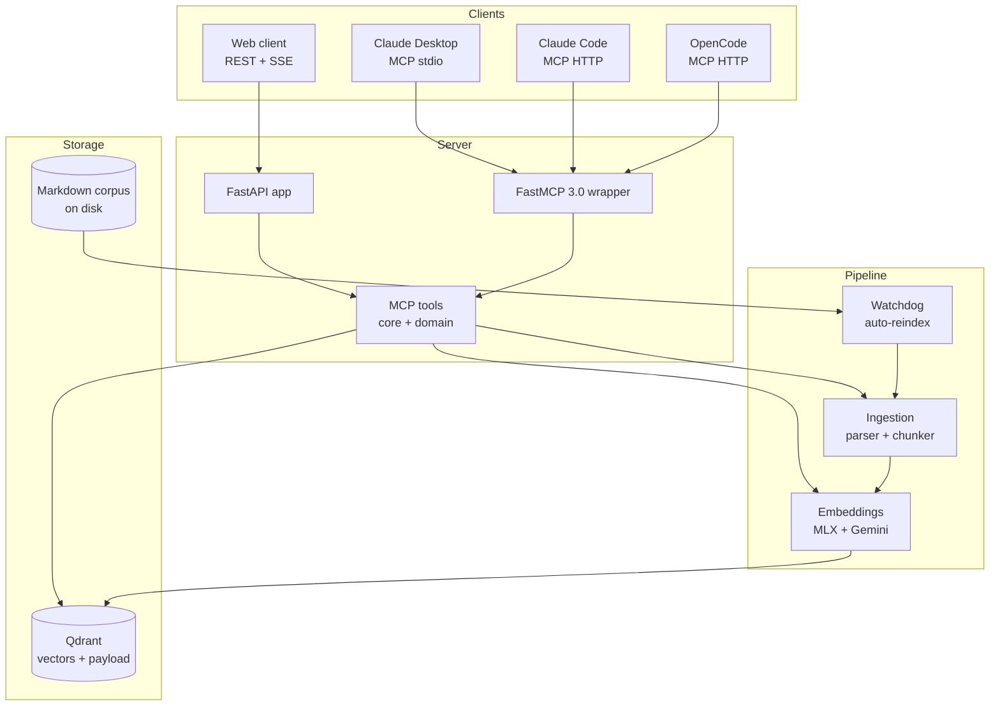

# SDET Brain

> Persistent RAG for the SDET brand domain. Shared context across Claude
> Desktop, Claude Code, OpenCode, and other MCP clients - so handoff documents
> between threads stop being a chore.

[](https://www.python.org)
[](#license)
[](#status)

## Why this exists

I write a lot of brand-related material in scattered Markdown files: project
context, voice samples, decision logs, sprint reports. Every new Claude.ai
chat used to start with the same paste-the-context dance.

SDET Brain is a single source of truth that any MCP-aware client can query
through the same set of tools. Embeddings live in Qdrant, sources stay on
disk, and a file watcher keeps the index fresh as I edit.

## Architecture (high level)



The four layers map to top-level packages: `server/`, `ingestion/`,
`embeddings/`, and `storage/`. CLI entrypoints live in `cli/`.

## Stack

| Layer | Choice |
| --- | --- |
| Vector store | Qdrant 1.12+ (Docker, self-hosted) |
| Embeddings (primary) | MLX local - `Qwen/Qwen3-Embedding-0.6B` (1024-dim) |
| Embeddings (fallback) | Google Gemini `text-embedding-004` (768-dim) |
| Server | FastAPI + FastMCP 3.0 (stdio / SSE / streamable HTTP) |
| Ingestion | watchdog file watcher + python-frontmatter + semantic chunker |
| Tooling | uv, mypy --strict, ruff, pytest |

## Quick start

> Prerequisites: macOS or Linux, Python 3.12+, [uv](https://docs.astral.sh/uv/),
> Docker Desktop running.

```bash
git clone git@github.com:darco81/sdet-brain.git
cd sdet-brain

# 1. Install dependencies into a managed venv.
uv sync --extra dev

# 2. Copy env template and fill in any secrets you need.
cp .env.example .env

# 3. Start Qdrant in the background.
docker compose -f docker/docker-compose.yml up -d qdrant

# 4. (Coming in T1-06) Start the REST + MCP server.
uv run sdet-brain-server
```

Until the server task lands, use the smoke test to verify the install:

```bash
uv run pytest -q
```

## Embeddings

Two interchangeable providers expose the same `IEmbedder` contract
(`vector_size`, `model_name`, `embed`, `health_check`):

| Provider | When to use | Vector size | Notes |
| --- | --- | --- | --- |
| **MLX** (default) | Apple Silicon dev box | 1024 | Lazy-loads `Qwen/Qwen3-Embedding-0.6B` on first call. |
| **Gemini** | Cloud / VPS / laptop offline | 768 | Uses `text-embedding-004` via the `google-genai` SDK with `tenacity` retries. Requires `GEMINI_API_KEY`. |

Switch providers via `EMBEDDING_PROVIDER=mlx|gemini` in `.env`. The
factory runs a `health_check()` and falls back to the alternate provider
if the primary is unavailable. Mismatched vector sizes between providers
mean swapping the active provider implies re-creating the Qdrant
collection - acceptable as a one-time migration cost for a single-user
deploy.

```bash
# Encode a probe and print a vector preview.
uv run sdet-brain-embed encode "Hello SDET Brain"

# Inspect which provider answered, including any fallback chain.
uv run sdet-brain-embed health
```

## How to ingest your corpus

The pipeline walks Markdown files, parses frontmatter, chunks them
semantically, embeds the chunks, and upserts them into Qdrant. Re-runs
are idempotent: files whose `content_hash` has not changed are
skipped.

```bash
# 1. Make sure Qdrant is running and the collection exists.
docker compose -f docker/docker-compose.yml up -d qdrant
uv run sdet-brain-qdrant init

# 2. Ingest a directory (or a single file).
uv run sdet-brain-ingest /Users/you/notes
uv run sdet-brain-ingest /Users/you/notes/single-file.md

# 3. Re-running shows the cache hit.
uv run sdet-brain-ingest /Users/you/notes
# -> "skipped N files (cache)"

# 4. Force a re-embed (e.g. after switching embedding providers).
uv run sdet-brain-ingest /Users/you/notes --force
```

Source-type tagging is path-driven: files inside the brand drafts,
articles, sprint-reports, or project-knowledge directories pick up the
right `source_type` payload automatically. Anything outside lands as
`unknown`.

## Project status

This repo is at the **bootstrap** milestone (`v0.1.0`). The skeleton, tooling,
and Docker scaffolding are in place - everything else is sequenced as Linear
issues `SDE-18` through `SDE-36` (Tiers 1 / 2 / 3).

| Tier | Goal | Tracked in |
| --- | --- | --- |
| 1 (`v0.1.0`) | MVP - local Qdrant, ingestion pipeline, MCP server, 4 core tools | SDE-18..SDE-27 |
| 2 (`v0.2.0`) | Domain tools, hybrid search, reranking, local LLM | SDE-28..SDE-32 |
| 3 (`v0.3.0`) | Conversational chat, eval suite, VPS deploy with HMAC auth | SDE-33..SDE-36 |

See [`docs/sprints/`](docs/sprints/) for per-task sprint reports.

## Development workflow

```bash
uv run ruff check src tests       # lint
uv run mypy --strict src          # type check
uv run pytest -v                  # tests
```

Conventional commits, atomic per Linear issue. Branches are not pushed
automatically - the maintainer reviews each commit before pushing to GitHub.

## Repo layout

```
sdet-brain/
├── src/sdet_brain/        # importable package
│   ├── ingestion/          # parser, chunker, watcher (T1-04, T1-05, T1-08)
│   ├── embeddings/         # MLX + Gemini providers (T1-03)
│   ├── storage/            # Qdrant client wrapper (T1-02)
│   ├── server/             # FastAPI + FastMCP + MCP tools (T1-06, T1-07)
│   └── cli/                # uv-installable entrypoints
├── tests/                  # pytest suites mirroring src/
├── docker/                 # docker-compose.yml + Dockerfile
├── docs/                   # architecture, schemas, sprint reports
├── pyproject.toml          # deps + tooling config (mypy, ruff, pytest)
├── .env.example            # exhaustive list of env variables
├── CHANGELOG.md
└── README.md
```

## Background docs

Detailed planning lives outside this repo (private):

- `sdet-brand-drafts/SDET-BRAIN-BOOTSTRAP-PROMPT.md` - workflow + per-task
  context handed to Claude Code overnight.
- `sdet-brand-drafts/SDET-BRAIN-ARCHITECTURE.md` - decision log, performance
  budgets, threat model.

## License

Proprietary. Not for external distribution while the brand corpus remains
private.
