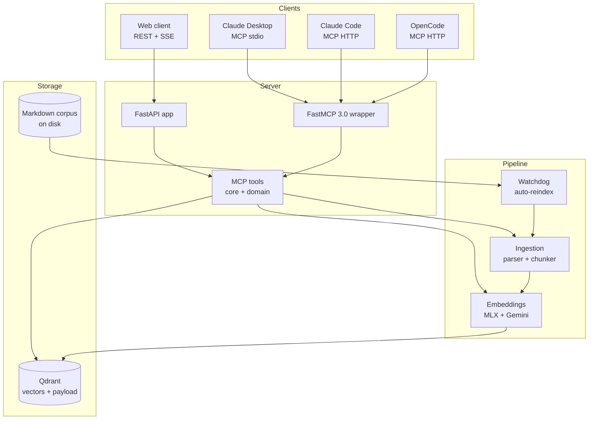

# SDET Brain

> Persistent RAG for the SDET brand domain. Shared context across Claude
> Desktop, Claude Code, OpenCode, and other MCP clients - so handoff documents
> between threads stop being a chore.

[](CHANGELOG.md)
[](https://www.python.org)
[](#testing)
[](LICENSE)
[](#status)

## Why this exists

I write a lot of brand-related material in scattered Markdown files: project
context, voice samples, decision logs, sprint reports. Every new Claude.ai
chat used to start with the same paste-the-context dance.

SDET Brain is a single source of truth that any MCP-aware client can query
through the same set of tools. Embeddings live in Qdrant, sources stay on
disk, and a file watcher keeps the index fresh as I edit.

## Quick start

```bash
# Prerequisites: Docker Desktop running, Python 3.12+, uv installed.

# 1. Start Qdrant.
docker compose -f docker/docker-compose.yml up -d qdrant

# 2. Install + sync deps.
uv sync

# 3. Ingest your corpus (Markdown only, recursive).
uv run sdet-brain-cli /path/to/your/markdown/corpus

# 4. Run the daemon.
uv run sdet-brain-server &

# 5. Try it.
sdet-brain-chat                          # terminal REPL
sdet-brain run voice-check               # saved query template
curl -s http://localhost:8080/search \
  -X POST -H "Content-Type: application/json" \
  -d '{"query":"what we shipped","limit":5}' | jq .
```

For Claude Desktop / Claude Code MCP wiring, see the
[Tier 1 sprint report](docs/sprints/v0.1.0-tier-1-sprint-report.md) and the
Operations section below.

## Architecture (high level)



The four layers map to top-level packages: `server/`, `ingestion/`,
`embeddings/`, and `storage/`. CLI entrypoints live in `cli/`.

## Stack

| Layer | Choice |
| --- | --- |
| Vector store | Qdrant 1.12+ (Docker, self-hosted) |
| Embeddings (primary) | MLX local - `Qwen/Qwen3-Embedding-0.6B` (1024-dim) |
| Embeddings (fallback) | Google Gemini `text-embedding-004` (768-dim) |
| Server | FastAPI + FastMCP 3.0 (stdio / SSE / streamable HTTP) |
| Ingestion | watchdog file watcher + python-frontmatter + semantic chunker |
| Tooling | uv, mypy --strict, ruff, pytest |

## Install from source

```bash
git clone git@github.com:darco81/sdet-brain.git
cd sdet-brain
uv sync --extra dev
cp .env.example .env   # fill in any secrets you need
docker compose -f docker/docker-compose.yml up -d qdrant
uv run pytest -q       # verify the install (213 passing)
```

## Embeddings

Two interchangeable providers expose the same `IEmbedder` contract
(`vector_size`, `model_name`, `embed`, `health_check`):

| Provider | When to use | Vector size | Notes |
| --- | --- | --- | --- |
| **MLX** (default) | Apple Silicon dev box | 1024 | Lazy-loads `Qwen/Qwen3-Embedding-0.6B` on first call. |
| **Gemini** | Cloud / VPS / laptop offline | 768 | Uses `text-embedding-004` via the `google-genai` SDK with `tenacity` retries. Requires `GEMINI_API_KEY`. |

Switch providers via `EMBEDDING_PROVIDER=mlx|gemini` in `.env`. The
factory runs a `health_check()` and falls back to the alternate provider
if the primary is unavailable. Mismatched vector sizes between providers
mean swapping the active provider implies re-creating the Qdrant
collection - acceptable as a one-time migration cost for a single-user
deploy.

```bash
# Encode a probe and print a vector preview.
uv run sdet-brain-embed encode "Hello SDET Brain"

# Inspect which provider answered, including any fallback chain.
uv run sdet-brain-embed health
```

## Running the server

Three transports cover the realistic deployment surfaces:

```bash
# 1. REST + MCP-over-HTTP (default - serves /health, /status,
#    /search, /ingest, /docs, /openapi.json, plus /mcp for MCP-HTTP).
uv run sdet-brain-server

# 2. MCP over stdio (the transport Claude Desktop uses).
uv run sdet-brain-mcp-stdio

# 3. MCP over Server-Sent Events (long-lived connection for remote
#    Claude Code or OpenCode clients; defaults to port 8081).
uv run sdet-brain-mcp-sse
```

### Claude Desktop integration

Claude Desktop **does not natively support** the HTTP transport in
`mcpServers`. You need a stdio bridge - the `mcp-remote` npm package
forwards stdio calls to the streamable-HTTP server running on
`localhost:8080`.

**Working config** (`~/Library/Application Support/Claude/claude_desktop_config.json`):

```json
{
  "mcpServers": {
    "sdet-brain": {
      "command": "npx",
      "args": ["-y", "mcp-remote", "http://localhost:8080/mcp"]
    }
  }
}
```

After saving, **Cmd+Q** Claude Desktop (full quit, not just closing
the window), then relaunch and verify `sdet-brain` shows up in the
MCP tools list.

If you'd rather skip the bridge entirely, point Claude Desktop straight
at the stdio entrypoint installed by `uv sync`:

```json
{
  "mcpServers": {
    "sdet-brain": {
      "command": "/Users/<you>/dev/darco81/sdet-brain/.venv/bin/sdet-brain-mcp-stdio"
    }
  }
}
```

**Claude Code (CLI) uses a different format** - native HTTP transport
works directly there:

```json
{
  "mcpServers": {
    "sdet-brain": {
      "type": "http",
      "url": "http://localhost:8080/mcp"
    }
  }
}
```

## Daily usage

### REPL chat (`sdet-brain-chat`)

Multi-turn conversation in the terminal. Streaming tokens, slash
commands, inline `[N]` citations from the retrieved corpus.

```bash
$ sdet-brain-chat
> co planujemy na publication week
[streaming response with [1], [2] citation markers]
> /sources
[1] /Users/.../from-the-field/wcag-toolkit-part-1.en.md  score=0.78
    short snippet of the cited chunk...
[2] /Users/.../sprint-reports/v0.5.0-tier-5-dx-sprint.md score=0.72
> /save publication-plan
> /quit
```

Slash commands: `/help`, `/clear`, `/sources`, `/save NAME`,
`/load NAME`, `/quit`. Conversation JSON dumps live under
`~/.sdet-brain/conversations/`.

### Saved templates (`sdet-brain run`)

YAML query templates with Jinja2 substitution.

```bash
$ sdet-brain template list
$ sdet-brain run voice-check --var topic="self-deprecating opener"
$ sdet-brain run series-status --var number="01"
```

Pre-shipped: `voice-check`, `series-status`, `decision-history`,
`wcag-fact-check`. Custom templates land in
`~/.sdet-brain/templates/<name>.yaml` and override the shipped ones
on name collision.

### MCP tools (11)

Available to Claude Desktop / Claude Code / OpenCode / any MCP-aware
client over stdio, SSE, or streamable HTTP.

**Core (5)** - `ping`, `search`, `ingest_path`, `list_sources`,
`get_chunk_neighbors`.

**Domain (5)** - `search_voice_samples`, `search_smaczki`,
`search_decisions`, `list_articles_by_status`,
`search_sprint_reports`. Each preset filter on `category` so the LLM
picks the right tool from the user's phrasing.

**LLM-backed (3)** - `query_rewrite` (HyDE expansion via gemma-4
fast tier), `summarize_results` (cited summary via Qwen-Next-Instruct),
`multi_query_search` (Thinking-tier decomposition into 3-5 sub-queries
with RRF fusion).

Tool descriptions visible to Claude include "Use when…" hints to
keep call patterns predictable. Inspect the catalogue with
`npx @modelcontextprotocol/inspector uv run sdet-brain-mcp-stdio`.

## How to ingest your corpus

The pipeline walks Markdown files, parses frontmatter, chunks them
semantically, embeds the chunks, and upserts them into Qdrant. Re-runs
are idempotent: files whose `content_hash` has not changed are
skipped.

```bash
# 1. Make sure Qdrant is running and the collection exists.
docker compose -f docker/docker-compose.yml up -d qdrant
uv run sdet-brain-qdrant init

# 2. Ingest a directory (or a single file).
uv run sdet-brain-ingest /Users/you/notes
uv run sdet-brain-ingest /Users/you/notes/single-file.md

# 3. Re-running shows the cache hit.
uv run sdet-brain-ingest /Users/you/notes
# -> "skipped N files (cache)"

# 4. Force a re-embed (e.g. after switching embedding providers).
uv run sdet-brain-ingest /Users/you/notes --force
```

Source-type tagging is path-driven: files inside the brand drafts,
articles, sprint-reports, or project-knowledge directories pick up the
right `source_type` payload automatically. Anything outside lands as
`unknown`.

### Configure your corpus paths

The CLI reads source roots from environment variables (one comma-
separated list per `source_type`). On Dariusz's local box every var is
empty and the CLI falls back to a hard-coded default that points at
his repos. On any other machine - especially the VPS deploy in T3-03
- set the env vars explicitly so files outside Dariusz's home are
classified correctly:

```bash
# .env or shell env
PROJECT_KNOWLEDGE_PATHS=/srv/brand/drafts
DRAFTS_PATHS=/srv/brand/drafts
ARTICLES_PATHS=/srv/brand/articles
SPRINT_REPORTS_PATHS=/srv/brand/sprint-reports/toolkit,/srv/brand/sprint-reports/pro
BRIEF_PATHS=/srv/brand/brief
```

Each var accepts a comma-separated list. Empty means "fall back to
the local default". The watcher (`sdet-brain-watcher`) reads the
same vars so a single `.env` controls both ingestion modes.

## Live sync mode (file watcher)

Run the watcher daemon to keep the brain in step with on-disk edits.
A 300 ms debounce window collapses VS Code's burst of save events into
a single re-ingest; deletes are propagated as `delete_by_filter`
calls so removed files vanish from the index.

```bash
# Foreground - tail the logs to see "Re-ingested ... (N chunks ...)".
WATCH_PATHS=/Users/you/notes,/Users/you/drafts uv run sdet-brain-watcher

# Or: run the watcher container alongside Qdrant.
SDET_BRAIN_CORPUS_HOST=/Users/you/notes \
  docker compose -f docker/docker-compose.yml --profile watcher up -d
```

`SIGINT` / `SIGTERM` triggers a graceful shutdown that drains any
pending debounced events. Hidden files, `node_modules`, and anything
that isn't `.md` are filtered automatically.

## Operations

The brain is "set and forget" on a single Mac: a `launchd` agent
boots `sdet-brain-server` at login, Qdrant runs from
`docker compose`, and both Claude Desktop and Claude Code talk to
the same `:8080/mcp` endpoint. This section covers the few moments
when you need to look under the hood.

### 30-second health check

Three commands tell you whether the stack is alive:

```bash
# Daemon process up?
launchctl list | grep darkow
# -> 8-digit PID  0  com.darkow.sdet-brain

# Server + Qdrant + embedder reachable?
curl -s http://localhost:8080/health | jq .
# -> status=ok, embedder_ok=true, collection_count > 0

# Claude Code sees it?
claude mcp list | grep sdet-brain
# -> http://localhost:8080/mcp (HTTP) - ✓ Connected
```

If all three pass: the brain is fine.

### Restart commands

```bash
# Restart the server daemon (reloads Settings + clears any wedged state).
launchctl kickstart -k "gui/$(id -u)/com.darkow.sdet-brain"

# Restart Qdrant (if /readyz returns 503 or compose ps shows unhealthy).
docker compose -f docker/docker-compose.yml restart qdrant

# Hard restart of both (when in doubt - takes ~20 s).
launchctl unload ~/Library/LaunchAgents/com.darkow.sdet-brain.plist
docker compose -f docker/docker-compose.yml down
docker compose -f docker/docker-compose.yml up -d qdrant
launchctl load -w ~/Library/LaunchAgents/com.darkow.sdet-brain.plist
sleep 12 && curl -s http://localhost:8080/health | jq .status
```

### Logs

```bash
# Server (uvicorn + lifespan + per-request).
tail -f /tmp/sdet-brain-server.log
tail -f /tmp/sdet-brain-server.err.log

# Qdrant container.
docker logs -f sdet-brain-qdrant
```

### Troubleshooting

**Brain not responding at all** -- daemon down or port 8080 taken.

```bash
launchctl list | grep darkow                  # if missing -> reload plist
lsof -iTCP:8080 -sTCP:LISTEN                   # if foreign owner -> kill it
tail -50 /tmp/sdet-brain-server.err.log        # check the crash trail
```

**Search returns empty results** -- Qdrant collection missing or empty.

```bash
curl -s localhost:6333/collections | jq .
# If sdet_brand_v1 is missing:
uv run sdet-brain-qdrant init
# If empty (chunks=0):
uv run sdet-brain-cli /Users/you/notes  # re-ingest your corpus
```

**MLX model first-call cold start** -- expected, ~2-5 s on M-series.
Subsequent calls are warm. Check the `embedder_ok=true` flag in
`/health` to confirm the lazy load worked.

**`mcp-remote` keeps reconnecting** -- known issue when Claude
Desktop loses the daemon between auto-restarts. Either:
- restart Claude Desktop (`Quit & Restart` from menu), or
- run `launchctl kickstart -k gui/$(id -u)/com.darkow.sdet-brain`
  and reopen the chat.

**Linear MCP plugin says `! Needs authentication`** -- OAuth token
expired (typically every ~24 h). In CC: type `/mcp`, find
`plugin:linear:linear`, click `Authenticate`, complete the browser
flow.

**Watcher not picking up edits** -- it filters `.md` only and skips
hidden / `node_modules`. Confirm the path matches your watch list
and the file ends in `.md`. For non-`.md` content, ingest manually
via `sdet-brain-cli`.

### Backup + restore

The corpus lives on disk; Qdrant stores embeddings derived from it.
A disaster recovery is one command:

```bash
uv run sdet-brain-cli /Users/you/notes  # re-embed everything
```

For point-in-time vector backups (before `v0.2.0` collection
migration in T2-03):

```bash
# Snapshot.
curl -X POST localhost:6333/collections/sdet_brand_v1/snapshots
docker cp sdet-brain-qdrant:/qdrant/snapshots ./backups/

# Restore.
curl -X PUT localhost:6333/collections/sdet_brand_v1/snapshots/recover \
  -H 'Content-Type: application/json' \
  -d '{"location":"<snapshot path>"}'
```

## How this was built

Six release tiers (`v0.1.0` → `v0.5.0`) shipped between 2026-04-30 and
2026-05-01 across three Claude Code sessions, driven by hand-written
sprint prompts kept in a sibling private directory (`SDET-BRAIN-*-PROMPT.md`
files, not part of this repository).
Each tier was scoped, tracked, and closed with the same discipline:

- **Per-issue Linear tracking** with decisions, quality gates, and
  smoke results documented as comments before close.
- **Atomic conventional commits** - one feature per commit, no mixed
  concerns.
- **Quality gates re-run before every commit**: `pytest` (213 tests by
  v0.5.0), `mypy --strict` (70 source files), `ruff` clean.
- **Sprint report per tier** in [`docs/sprints/`](docs/sprints/) with
  goals vs delivered, lessons learned, and a morning checklist for
  the next session.
- **Explicit deferral with reopen criteria** for everything that
  didn't fit a sprint window - see the Backlog subsection of
  [Status](#status) for the live list and Linear refs.

The compressed timeline is intentional: each prompt was an autonomous
overnight run, and the discipline of *write the prompt first, then
execute* is what kept scope honest. Read any of the
`SDET-BRAIN-*-PROMPT.md` files alongside the matching tier sprint
report to see the loop end-to-end.

## Status

**v0.5.0 - Production-ready (local-only).** Six sprints shipped between
2026-04-30 and 2026-05-01.

| Tier | Tag | Highlights |
| --- | --- | --- |
| 1 | `v0.1.0` | MVP - Qdrant + MLX embeddings + 4 core MCP tools + watcher |
| 1 polish | `v0.1.1` | Bash healthcheck, env-driven paths, perf optimizations |
| 2 | `v0.2.0` | Hybrid search (BM25 + RRF) + cross-encoder reranking + 5 domain tools + frontmatter taxonomy |
| 3 | `v0.3.0` | Local MLX LLM (Qwen3-Next-80B) + conversational `/chat` + SSE streaming |
| 4 | `v0.4.0` | Tier 4 ALL IN - Qwen3-Embedding-8B + tiered LLM router + multi-query agentic retrieval |
| 5 | `v0.5.0` | DX - REPL CLI + inline citations + saved templates |

**213 tests passing.** mypy --strict + ruff clean across 70 source files.

See [`docs/sprints/`](docs/sprints/) for per-tier sprint reports and
[`CHANGELOG.md`](CHANGELOG.md) for the per-version changelog.

### Backlog (post-deploy)

- VPS deployment with HMAC auth + Gemini fallback
- SQLite conversation persistence + FTS5
- Reranker upgrade (Qwen3-Reranker MLX)
- GraphRAG-lite (entity + relation extraction)
- PDF ingestion (DeepSeek-OCR-2)
- Image ingestion (qwen3-vl)

Each backlog item has explicit reopen criteria in Linear.

## Development workflow

```bash
uv run ruff check src tests       # lint
uv run mypy --strict src          # type check
uv run pytest -v                  # tests
```

Conventional commits, atomic per Linear issue. Branches are not pushed
automatically - the maintainer reviews each commit before pushing to GitHub.

## Repo layout

```
sdet-brain/
├── src/sdet_brain/        # importable package
│   ├── ingestion/          # parser, chunker, watcher (T1-04, T1-05, T1-08)
│   ├── embeddings/         # MLX + Gemini providers (T1-03)
│   ├── storage/            # Qdrant client wrapper (T1-02)
│   ├── server/             # FastAPI + FastMCP + MCP tools (T1-06, T1-07)
│   └── cli/                # uv-installable entrypoints
├── tests/                  # pytest suites mirroring src/
├── docker/                 # docker-compose.yml + Dockerfile
├── docs/                   # architecture, schemas, sprint reports
├── pyproject.toml          # deps + tooling config (mypy, ruff, pytest)
├── .env.example            # exhaustive list of env variables
├── CHANGELOG.md
└── README.md
```

## Background docs

Detailed planning lives outside this repo (private):

- Workflow prompts (`SDET-BRAIN-BOOTSTRAP-PROMPT.md`) - per-task
  context handed to Claude Code overnight.
- Architecture log (`SDET-BRAIN-ARCHITECTURE.md`) - decisions,
  performance budgets, threat model.

## License

Source-available, license terms in [LICENSE](LICENSE).

**Short version:** code is here for transparency and reference. You can
inspect it, learn from the architecture, and run it locally for your
own evaluation. Commercial deployments, hosted variants, and
multi-tenant integrations are separate engagements.

A formal OSI license (likely AGPL-3.0 or similar) may be selected in
a future release as part of a structured public launch.
